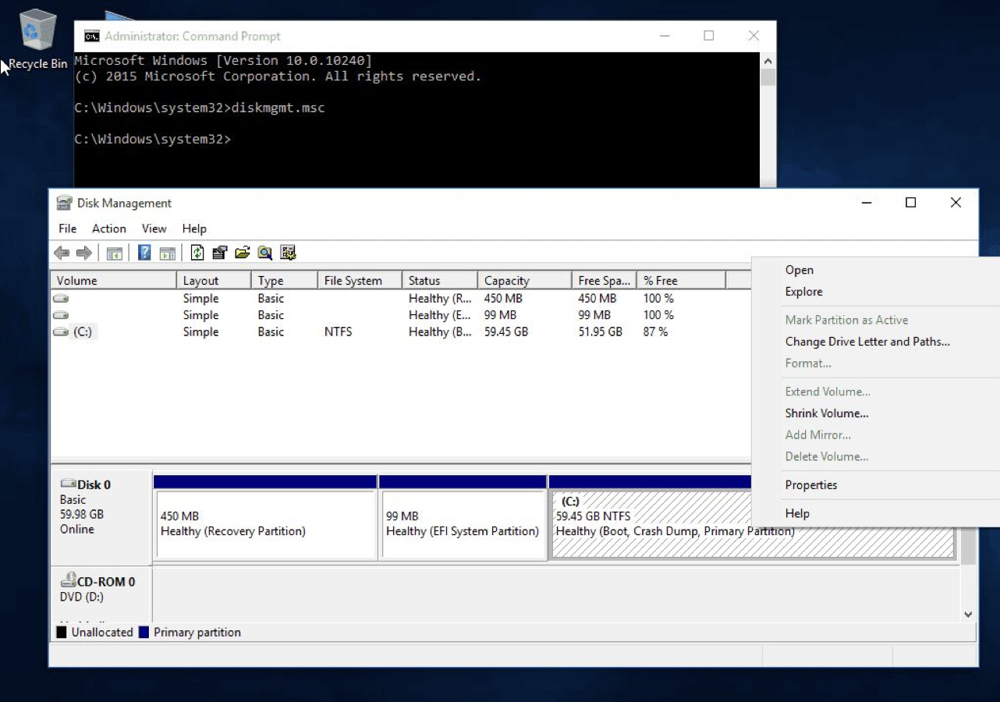

# Dual Booting Instructions

Before going ahead, if you unsure about any of the steps please contact one of the TAs. 

# How to Dual Boot Windows and Linux (Ubuntu) [FREE]

Dual-booting allows you to use both Windows and Linux on the same computer. Here's a detailed guide to set it up efficiently and safely.

---

## **1. Prepare Your System**

1. **Backup Your Data**  
   Before making any changes, back up important files. Although dual booting is generally safe, it's better to be cautious.  

2. **Check System Requirements**  
   Ensure your computer meets the following:
   - At least 60 GB of free disk space.
   - A working USB port or DVD drive.

3. **Download Ubuntu**  
   - Visit the [official Ubuntu website](https://releases.ubuntu.com/jammy/) and download the AMD desktop image.  
   - **Note**: We will be using using Ubuntu Jammy (22.04).

4. **Create a Bootable USB or DVD**  
   - Download a tool like [Rufus](https://rufus.ie) for USB or [PowerISO](https://www.poweriso.com/download.htm).  
   - Insert a USB drive (minimum 8 GB). **Warning**: All data on the USB will be erased.  
   - Open Rufus, select the downloaded Ubuntu ISO, and create a bootable USB. Follow [this guide](https://ubuntu.com/tutorials/create-a-usb-stick-on-windows#1-overview) if needed.

---

## **2. Prepare Windows**

1. **Disable Fast Startup**  
   - Open the Windows Start Menu and search for "Power Options."  
   - Click "Choose what the power buttons do" > "Change settings that are currently unavailable."  
   - Uncheck "Turn on fast startup" and save the settings.

2. **Disable Secure Boot (if needed)**  
   - Restart your computer and enter the BIOS/UEFI settings by pressing `F2`, `F12`, `F10`, or `ESC` (varies by manufacturer).  
   - Locate "Secure Boot" and disable it. Save and exit.

3. **Create Free Space for Linux**  
   - Log in to Windows and right-click the Start Menu, then search for "Disk Management" (`diskmgmt.msc`).  
   - Right-click your primary partition (usually C: drive) and select "Shrink Volume."  
   - Enter at least 60,000 MB for the shrink size (depending on your available space). Click "Shrink."  
        
        
   - Leave the unallocated space as it is.  
        
   **Warning**: Ensure you do not delete or modify system-critical partitions.

---

## **3. Boot into Ubuntu Installer**

1. **Insert the Bootable USB/DVD**  
   Plug in the USB or insert the DVD you created earlier.

2. **Restart and Boot from USB/DVD**  
   - Restart your computer and enter the BIOS/UEFI boot menu by pressing `F12`, `F10`, `F2`, or similar.  
   - Select the USB or DVD as the boot device.

3. **Try Ubuntu or Install Ubuntu**  
   - Select "Try Ubuntu" to explore Ubuntu without installing.  
   - Select "Install Ubuntu" to begin the installation process.  
      

---

## **4. Install Ubuntu**

1. **Choose Installation Language**  
   Select your preferred language and click "Continue."  
    

2. **Prepare for Installation**  
   - Choose "Normal Installation."  
   - Check "Download updates while installing Ubuntu" (recommended).  
   - Check "Install third-party software" for Wi-Fi and media support.  
      

3. **Select Installation Type**  
   - Select "Something Else" to manually partition the unallocated space.  
        
   **Warning**: Do **not** choose "Erase disk and install Ubuntu" as it will delete all data.

4. **Create Partitions**  
   - **Root Partition**:  
     - Size: Remaining free space minus 10,000 MB.  
     - Type: Primary.  
     - File System: EXT4.  
     - Mount Point: `/`.  
        
   - **Swap Partition**:  
     - Size: 10,000 MB.  
     - Type: Swap Area.  
        

5. **Start Installation**  
   - Click "Install Now" and confirm when prompted.  
   - Select your location and time zone.  
   - Create a user account with a username and password.  
   - Wait for the installation to complete.

---

## **5. Configure Boot Options**

1. **Restart After Installation**  
   - Remove the USB/DVD when prompted and press Enter to restart.

2. **GRUB Bootloader**  
   - Upon restarting, the GRUB menu will appear, allowing you to choose between:  
     - **Ubuntu**: Boots into Linux.  
     - **Windows Boot Manager**: Boots into Windows.  
        

---

## **6. Post-Installation Steps**

1. **Update Ubuntu**  
   - Open a terminal (`Ctrl+Alt+T`) and run:
     ```
     sudo apt-get update && sudo apt-get upgrade
     ```
   - When prompted with `Yes`/`No`, press `Y` and hit Enter.  
   - Run:
     ```
     sudo reboot
     ```

2. **Access Files from Windows**  
   - Windows files are accessible under "Other Locations" in Ubuntu's File Manager.

---

## **Tips and Troubleshooting**

1. **Can’t See GRUB Menu?**  
   - Restart and press `Shift` or `ESC` during startup.  
   - If GRUB doesn’t show, repair it using a live USB.

2. **Need More Disk Space for Ubuntu?**  
   - Use "Disk Management" in Windows to shrink partitions further.

3. **Switching Between Systems**  
   - Restart and select the OS from the GRUB menu.

---

Enjoy your journey into Linux!


---

# How to Install Ubuntu on a Mac [PAID]

Parallels Desktop allows you to run a virtual machine on your Mac, making it easy to install and use Ubuntu alongside macOS. This guide explains how to set up Ubuntu using Parallels on both Intel and M-series Macs.

---

## **1. Prerequisites**

1. **Mac Requirements**:
   - An Intel or M-series Mac with sufficient disk space (at least 20 GB free).
   - Parallels Desktop installed (download from [Parallels website](https://www.parallels.com)).

2. **Download Ubuntu**:
   - Visit the [Ubuntu website](https://ubuntu.com/download/desktop) and download the correct version of Ubuntu:
     - **Intel Macs**: Download the standard x86-64 version.
     - **M-series Macs**: Download the ARM64 version.
     - Please install **Ubuntu 22.04**!

3. **Parallels Account**:
   - Create a Parallels account if you don’t already have one.

---

## **2. Install Parallels Desktop**

1. **Download Parallels**:
   - Go to [Parallels Desktop](https://www.parallels.com) and download the installer.

2. **Install Parallels**:
   - Double-click the downloaded `.dmg` file.
   - Drag the Parallels icon into the Applications folder.
   - Open Parallels from the Applications folder and follow the setup instructions.

3. **Activate Parallels**:
   - Sign in to your Parallels account. Try free version first. 
   - Enter your license key if required. 

---

## **3. Create a New Virtual Machine**

1. **Launch Parallels**:
   - Open Parallels Desktop and click **File > New** to create a new virtual machine.

2. **Select Installation Source**:
   - Choose **Install Windows or another OS from a DVD or image file** and click "Continue."
     

3. **Locate Ubuntu ISO**:
   - Click "Choose Manually" and select the Ubuntu ISO file you downloaded.
   -  

4. **Choose Operating System**:
   - Parallels should automatically detect Ubuntu. 

5. **Set Up the Virtual Machine**:
   - **Name**: Give your virtual machine a name (e.g., "Ubuntu VM").
   - **Location**: Choose a location to store the VM files.
    

6. **Customize Hardware (Optional)**:
   - Allocate resources to the VM:
     - **CPU**: 2 or more cores.
     - **RAM**: At least 4 GB.
     - **Disk Space**: 20 GB or more.
     - **Graphics**: Leave as default.
   - Click "Create."

---

## **4. Install Ubuntu**

1. **Start the Virtual Machine**:
   - Select your newly created virtual machine and click "Start."
   - Choose Try or Install Ubuntu Server
     

2. **Ubuntu Installation Process**:
   - Select your language and click **Install Ubuntu.**
     
   - Check **Download updates while installing Ubuntu** and **Install third-party software** (optional but recommended).
   - Click **Continue.**
   - Keep pressing "Done" (without entering anything) until you reach:
     
   - Enter your name, a username, and a password. Click **Continue.**
     
   - Hit **Continue**

6. **Complete Installation**:
   - Wait for the installation to complete.
     
   - Click **Reboot Now** when prompted and remove the ISO file from the virtual drive.

---

## **5. Optimize Ubuntu in Parallels (Optional step | can skip)**

1. **Install Parallels Tools**:
   - Once Ubuntu boots, click **Actions > Install Parallels Tools** from the Parallels menu.
   - Open the mounted Parallels Tools CD in Ubuntu and follow the installation instructions.

2. **Adjust Display Settings**:
   - Go to **Settings > Displays** in Ubuntu and configure the resolution as needed.

3. **Enable Clipboard Sharing and Drag & Drop**:
   - Ensure clipboard sharing and file drag & drop are enabled in the Parallels VM settings.

---

## **6. Updating the system**

1. You will be prompted for user and login password which you chose above. 
   

2. **Update Ubuntu**:
   - Open a terminal (Ctrl+Alt+T) and run:
     ```bash
     sudo apt update && sudo apt upgrade
     ```
   

3. It will take some time to finish this step, once done, reboot using:
   ```bash
   sudo reboot
   ```
   
---

## **7. Installing the desktop image**

1. You will be prompted again with the user and login password. 
   

2. **Install desktop image**:
   - Open a terminal (Ctrl+Alt+T) and run:
     ```bash
     sudo apt install ubuntu-desktop 
     ```
   

3. It will take roughly 10-15 minutes (or more depending on your internet connectivity) to finish this step, once done reboot using:
   ```bash
   sudo reboot
   ```
   
---

## **8. Finishing up**

1. **Log in to Ubuntu**:
   - Enter the password you created earlier to log in.
     

2. **Complete Setup**:
   - Follow the on-screen prompts to finalize the setup.
     

3. **Verify**:
   - Reboot one final time to ensure everything is working correctly:
     ```bash
     sudo reboot
     ```
   
---

## **Tips and Troubleshooting**

1. **VM Performance**:
   - If Ubuntu is slow, allocate more CPU cores or RAM to the virtual machine via the Parallels settings.

2. **Networking Issues**:
   - Check the VM's network adapter settings and ensure it’s set to "Shared Network" for internet access.

3. **Switch Between macOS and Ubuntu**:
   - Parallels allows you to run Ubuntu in "Coherence Mode," where Ubuntu apps run like native macOS apps. Enable it from the Parallels menu.

---

With Parallels Desktop, you can use Ubuntu on your Mac while enjoying the flexibility of macOS. Happy exploring!


